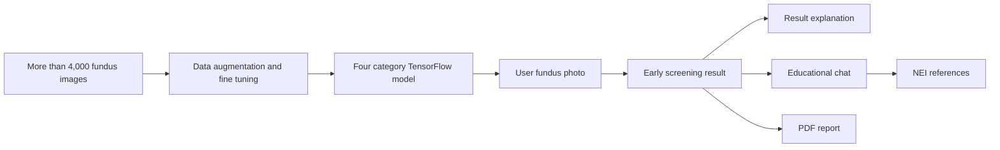

# NAYANA

NAYANA helps users understand an early screening result from a fundus photo. It reports pattern similarity for cataract, diabetic retinopathy, glaucoma, or a normal category. The result is not a diagnosis and must not be used to decide treatment.

## What it does

1. Upload a fundus photo or try an available example.
2. View pattern similarity results and their limitations.
3. Ask about the result through educational chat with National Eye Institute sources.
4. Save result history and create a PDF report.

## Product flow



## Screening model basis

NAYANA uses a TensorFlow model from the source project [`dlzcods/eye-disease-classification`](https://github.com/dlzcods/eye-disease-classification). The training notebook stored in this project uses the [Eye Diseases Classification Kaggle dataset](https://www.kaggle.com/datasets/gunavenkatdoddi/eye-diseases-classification) across four categories: normal, cataract, diabetic retinopathy, and glaucoma.

| Component | Summary |
| --- | --- |
| Data | 3,373 training images and 844 test images |
| Input | 224 by 224 RGB images |
| Model | EfficientNetB0 with ImageNet weights and a four category classification head |
| Data variation | rotation, horizontal flip, zoom, and brightness changes during training |
| Source evaluation | about 92% validation accuracy, 90.64% test accuracy, and 90.24% macro F1 on 844 images |

The training process fine tunes EfficientNetB0 and adds classification layers for the four categories. Data augmentation helps the model learn from image variation beyond the exact original images.

These figures describe source model development. They are not a claim of NAYANA clinical validation for a particular population or health facility. The reported glaucoma recall is lower than for some other classes, so NAYANA continues to present results as pattern similarity that requires ophthalmologist review.

## Run the web app

From the project root, run:

```bash
npm install
npm run dev:web
```

When the server starts, open the Vite address in a browser.

## Connect the web app to an API

Create `apps/web/.env.local`, then add the deployed API URLs:

```text
VITE_NAYANA_API_BASE_URL="https://YOUR-API-URL.modal.run"
VITE_NAYANA_REPORT_API_BASE_URL="https://YOUR-REPORT-URL.modal.run"
VITE_SUPABASE_URL="https://PROJECT-REF.supabase.co"
VITE_SUPABASE_PUBLISHABLE_KEY="sb_publishable_..."
```

Do not put Gemini, OpenRouter, or Firecrawl API keys in frontend files. Store them only in backend environment configuration or a Modal Secret.

## Deploy backend services

After completing `modal setup` and configuring secrets, run this from `apps/inference`:

```bash
modal deploy modal_app.py
modal deploy modal_report_app.py
```

`apps/inference/.env.example` lists possible environment names. After deployment, check RAG readiness:

```bash
curl -sS https://YOUR-API-URL.modal.run/v1/health | jq '.rag'
```

`ready` must be `true` before using RAG chat.

## Check changes

Before committing, run:

```bash
npm run validate
```

This checks project structure, the model checksum when present, CSS, lint, and the production build.

## Product boundary

NAYANA is an early screening companion, not a diagnostic tool. For symptoms, visual changes, or personal concerns, consult an ophthalmologist.

## Model source

The model, sample photos, notebooks, and license originate from the Hugging Face Space [`dielz/eye-disease-classification`](https://huggingface.co/spaces/dielz/eye-disease-classification). The source license is in `third_party/eye-disease-classification/LICENSE.txt`.

Read the [Indonesian version](README.md).
