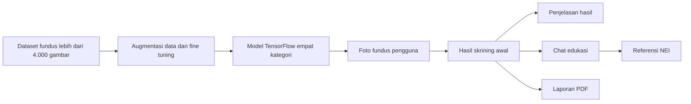

# NAYANA

NAYANA membantu pengguna memahami hasil skrining awal dari foto fundus. Sistem menunjukkan kemiripan pola terhadap katarak, retinopati diabetik, glaukoma, atau kategori normal. Hasil ini bukan diagnosis dan tidak digunakan untuk menentukan pengobatan.

## Yang dapat dilakukan

1. Mengunggah foto fundus atau mencoba contoh yang tersedia.
2. Melihat hasil kemiripan pola dan penjelasan batas hasilnya.
3. Bertanya tentang hasil melalui chat edukasi yang menampilkan sumber National Eye Institute.
4. Menyimpan riwayat hasil dan membuat laporan PDF.

## Alur produk



## Dasar model skrining

NAYANA menggunakan model TensorFlow dari project sumber [`dlzcods/eye-disease-classification`](https://github.com/dlzcods/eye-disease-classification). Notebook pelatihan yang disimpan di project menggunakan dataset [Eye Diseases Classification dari Kaggle](https://www.kaggle.com/datasets/gunavenkatdoddi/eye-diseases-classification) untuk membedakan empat kategori: normal, katarak, retinopati diabetik, dan glaukoma.

| Bagian | Ringkasan |
| --- | --- |
| Data | 3.373 gambar untuk pelatihan dan 844 gambar untuk pengujian |
| Input | gambar RGB berukuran 224 x 224 piksel |
| Model | EfficientNetB0 dengan bobot ImageNet dan head klasifikasi empat kategori |
| Variasi data | rotasi, flip horizontal, zoom, dan perubahan kecerahan saat pelatihan |
| Evaluasi sumber | validation accuracy sekitar 92%, akurasi pengujian 90,64%, macro F1 90,24% pada 844 gambar |

Proses pelatihan melakukan fine tuning pada EfficientNetB0, lalu menambahkan layer klasifikasi untuk menentukan empat kategori. Augmentasi data membantu model melihat variasi gambar yang tidak persis sama dengan data awal.

Angka tersebut adalah bukti pengembangan model sumber, bukan klaim validasi klinis NAYANA pada populasi atau fasilitas kesehatan tertentu. Karena recall glaukoma yang dilaporkan lebih rendah daripada beberapa kelas lain, hasil NAYANA tetap ditampilkan sebagai kemiripan pola dan perlu ditinjau dokter spesialis mata.

## Menjalankan tampilan web

Dari root project, jalankan:

```bash
npm install
npm run dev:web
```

Setelah server berjalan, buka alamat yang ditampilkan Vite di browser.

## Menghubungkan web ke API

Buat `apps/web/.env.local`, lalu masukkan URL API yang sudah deploy:

```text
VITE_NAYANA_API_BASE_URL="https://URL-API-ANDA.modal.run"
VITE_NAYANA_REPORT_API_BASE_URL="https://URL-REPORT-ANDA.modal.run"
VITE_SUPABASE_URL="https://PROJECT-REF.supabase.co"
VITE_SUPABASE_PUBLISHABLE_KEY="sb_publishable_..."
```

Jangan menaruh API key Gemini, OpenRouter, Netra, atau Firecrawl di file frontend. Key tersebut hanya disimpan di environment backend atau Modal Secret.

Chat NAYANA menggunakan source-attributed SSE. Antarmuka hanya menerima kalimat setelah server menemukan dukungan evidence dan marker sitasi; provider delta tidak pernah dikirim ke browser.

Untuk menjalankan Chat NAYANA melalui Netra Runtime, tambahkan `NETRA_API_KEY` ke Modal Secret `nayana`, lalu set `NAYANA_RAG_PROVIDER=netra` dan `NAYANA_RAG_NETRA_MODEL=deepseek/deepseek-v4-flash-0731`. Adapter Netra mengirim teks pertanyaan, konteks hasil, dan evidence NEI saja. Foto fundus tidak pernah masuk ke request model bahasa.

## Deploy layanan backend

Sebelum deploy pertama dari clone baru, pulihkan artefak model yang tidak disimpan di Git:

```bash
./apps/inference/tools/download-model.sh
```

Setelah `modal setup` selesai dan secret sudah tersedia, jalankan dari `apps/inference`:

```bash
modal deploy modal_app.py
modal deploy modal_report_app.py
```

Isi lengkap nama environment yang mungkin diperlukan tersedia di `apps/inference/.env.example`. Untuk memastikan chat RAG siap setelah deploy, periksa:

```bash
curl -sS https://URL-API-ANDA.modal.run/v1/health | jq '.rag'
```

`ready` harus bernilai `true` sebelum chat RAG digunakan.

## Memeriksa perubahan

Sebelum membuat commit, jalankan:

```bash
npm run validate
```

Perintah ini memeriksa struktur project, checksum model bila model tersedia, CSS, lint, dan production build.

## Batas penggunaan

NAYANA adalah pendamping skrining awal, bukan alat diagnosis. Bila ada keluhan, perubahan penglihatan, atau kekhawatiran pribadi, konsultasikan dengan dokter spesialis mata.

## Sumber model

Model, contoh foto, notebook, dan lisensi berasal dari project sumber dan Hugging Face Space [`dielz/eye-disease-classification`](https://huggingface.co/spaces/dielz/eye-disease-classification). Lisensi sumber tersedia di `third_party/eye-disease-classification/LICENSE.txt`.

Versi English tersedia di [README.en.md](README.en.md).
